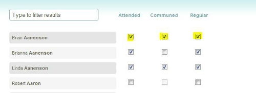

The Enter Attendance screen is used to record attendance for
the people who attend Events. The screen can also be used to update or
edit existing attendance data: 

### Recording Attendance

In order to enter attendance in 360Members, you must first [Add an
Event](events:%20New), making sure to mark the **Attendance Taken**
checkbox.

Begin entering attendance by choosing the **Event** to record attendance
for: 

Note: If the event you need, is not visible. Use the navigation arrows
at the top or bottom of the Event Selection bar to find additional
events.

Remember that in order to record attendance for an event, you must first
make sure you have [added the event](events:%20New).

After selecting the event, the entry portion of the page will load.

The **Listing** section shows which group of people will list in the
entry portion of the page. This defaults to **All People** which lists
all people records in your 360Members data. You can click the orange
link, select a **[Smart Group](people:%20Smart%20Groups)** which will
change the people listed in the entry portion of the page to only the
members of that Smart Group: 

At the top of the people list is a checkbox, labelled **I would like to
enter just a *count* for this event:**. If you only wish to record a
count of the number of people who attended this event (therefore, NOT
tracking individual attendance for this event), mark the checkbox, enter
the count, and click the **Save** button: 

When you enter attendance for an event for the first time, the next
section deals with your **Regular Attendees**. These are the people who
regularly attend this event. If you click on the link to **Select
regular attendees**, their corresponding checkboxes will be
automatically marked as Attended, Communed (if the Event involved
Communion), and as a Regular. 

To record individual attendances, mark the appropriate boxes to indicate
if a person has Attended an event, Communed at an event, or is a Regular
Attendee of an event. If you have previously clicked on **Select regular
attendees**, all attendance boxes will be marked for those people.

To lookup a specific person, type their name (or a portion of their
name) in the **Type to filter results** box: 

After marking each individual's attendance, you may wish to add an
additional count of others who attended this event. For example, when a
worship service is held, besides entering individual attendance, you may
have an additional "usher's count" of the number of people attending.
You can note this additional count at the top of the attendance page:

Clicking the **Save** button saves the attendance that has been marked,
then reloads the page. Clicking the **Reset** button undoes any changes
you've entered, and reverts the Attendance back to the last saved state
after page refreshes.

***Make sure to click the Save button to finalize the entry of your
attendance before navigating away from this page.***

* * * * *

**Feedback**: Click **<Feedback>** to ask for help, report a problem, or
make a suggestion to the Church360° Team.

**Export**: Click **Export** to export the attendance data to a CSV
(Comma-Separated Value) formatted data file. CSV is a widely-supported
data format which can be used with other programs (including Windows
Notepad, Microsoft Access, Excel, and Word).

* * * * *

**Related Topics:** [Add an Event](events-new), [Edit a
Person](people-profile-view)

* * * * *
