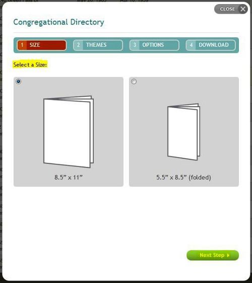
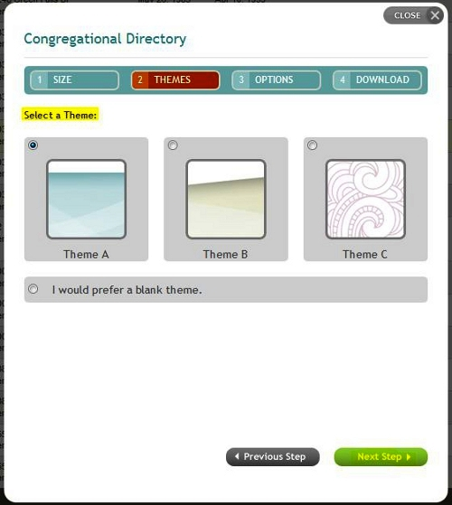
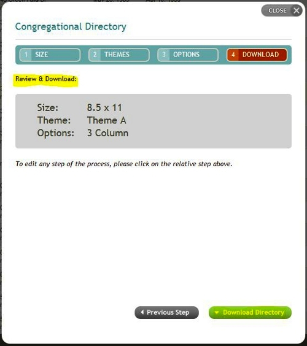
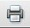
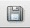

## Download Congregational Directory

#### To create a congregational directory, perform the following steps, clicking the ***Next Step*** button to proceed:

#### 1. Select a size:

#### 2. Choose a theme:

#### 3. Choose a layout:

Note: Also choose whether to include listed email addresses and phone
numbers, using the checkboxes at the lower left.

#### 4. Review & Download:

Verify your settings and click the ***Download Directory*** button at
the lower right to generate your church directory report. *Note: If you
wish to change any of your previously selected options, you can click on
the Size, Themes, or Options buttons at the top of the window to go back
to those settings (or use the Previous Step button at the lower right to
go back a screen).*

When the Download Directory button is clicked, the report will download
as an Adobe Acrobat document (\*.pdf). Depending on which web browser
and operating system you are using, the report may automatically open,
or you may be prompted to open or save the church directory.pdf file.

Once, you open the saved report in Adobe Acrobat Reader (or in any
Acrobat-compatible program) you can:

Click the  button on the report to
print out a hard copy of the report.

Click the  button on the report to save
the report as a .pdf document on your computer.

* * * * *

**Related Topics:** [[People List|people-View]], [[Household
List|people-Households]]

* * * * *
