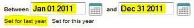
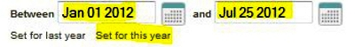
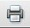
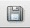

\<\\!----\>

#### To run a Contribution Statements report, perform the following steps:

#### 1. Set the date range:

#### 2. Alternatively, click the links under the date range to choose one of the following time periods:

-   Click **Set for last year**: Dates will be from January 1 to
    December 31 of the previous calendar year (in the example below,
    2011 is the previous year):

-   Click **Set for this year**: Dates will be from January 1 of the
    current year to today's current date (in the example below, the
    current date is July 25, 2012):

#### 3. If you want your church's federal ID to appear on the top of each statement, enter it:

#### 4. Click on the **Download** button:

When the Download button is clicked, the report will download as an
Adobe Acrobat document (\*.pdf). Depending on which web browser and
operating system you are using, the report may automatically open, or
you may be prompted to open or save the contribution statements.pdf
file.

Once, you open the saved report in Adobe Acrobat Reader (or in any
Acrobat-compatible program) you can:

Click the  button on the report to
print out a hard copy of the report.

Click the  button on the report to save
the report as a .pdf document on your computer.

* * * * *

**Related Topics:** [People List](people:%20View), [Household
List](people:%20Households), [Edit a
Household](people:%20Edit%20a%20Household), [Profile
View](people:%20Profile%20View), [Global Settings](settings:%20View)

* * * * *

**Go to:** [360members Help Chapters](Main%20Page)

* * * * *
