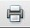

#### To download Mailing Labels, perform the following steps:

#### 1. Choose the Template (Type of Label):

#### 2. If you wish to print labels using Intelligent Mail® barcodes, mark the *This is part of a batch mailing* checkbox:

#### 3. If using using Intelligent Mail® barcodes, enter the following additional settings:

-   ***Mailer ID***: The Mailer ID is a 9-digit field or a 6-digit field
    within the Intelligent Mail® barcodes that is used to identify Mail
    Owners and/or Mailing Agents (those sending the mailing). The IDs
    are assigned by the USPS to each Mail Owner and/or Mailing Agent
    that requests them. Mailer IDs can be obtained by contacting the
    USPS *PostalOne\\!*® Help Desk at 800-522-9085 for letter and flat
    barcodes or the Confirmation Services Help Desk at 877-264-9693 for
    package barcodes, or contacting your local post office branch. In
    Church360°, you must enter this 9-digit or 6-digit Mailer ID in the
    box provided:

-   ***Serial Number***: The Serial Number is a secondary coding for use
    when generating Intelligent Mail® barcodes. It will also be
    provided by the USPS. According to the USPS specifications for the
    barcodes, a 6-digit Mailer ID must be paired with a 9-digit Serial
    Number or a 9-digit Mailer ID must be paired with a 6-digit Serial
    Number. The Serial Number is also optional and may be left blank.
    ***If you have a Serial Number, enter it in the box provided***:

-   ***Service Type***: Choose from ***First-Class Mail with No
    services***, ***Periodicals with no services***, or ***Bound Printed
    Matter with no services***. Select the appropriate option from the
    drop-down list:

#### 4. Click Download to generate your mailing labels report:

When the Download button is clicked, the report will download as an
Adobe Acrobat document (\*.pdf). Depending on which web browser and
operating system you are using, the report may automatically open, or
you may be prompted to open or save the mailing labels.pdf file.

Once, you open the saved report in Adobe Acrobat Reader (or in any
Acrobat-compatible program) you can:

Click the  button on the report to
print out a hard copy of the report.

Click the  button on the report to save
the report as a .pdf document on your computer.

* * * * *

**Related Topics:** [People List](people:%20View), [Household
List](people:%20Households), [Edit a
Household](people:%20Edit%20a%20Household), [Edit a
Person](people:%20Profile%20View)

* * * * *

**Go to:** [360Members Help Chapters](Main%20Page)

* * * * *
