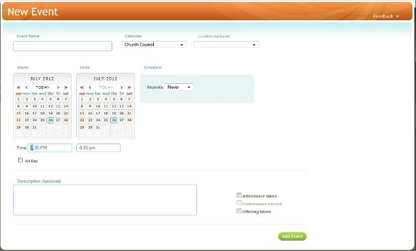

#### Adding a new event record

To add an event record, click **New Event** in the main
menu, fill in the fields with known information, then click the **Add
Event** button at the lower right of the screen. The following fields
are required when adding a new event: **Event Name**, **Calendar**,
**Start Date**, **End Date**, **Repeats**.

In addition, each Event created must have either a **Start Time** and an
**End Time**, OR the Event must be scheduled as an **All Day** Event.

#### List of Event Fields

-   **Event Name**: name of the event.
-   **Calendar**: Chose from the list of
    [Calendars](events:%20Calendars) in your Church360° database. New
    Calendars can be created by clicking on Calendars under the Events
    menu (on the left side of the screen).
-   **Location**: The location that the event will take place in. This
    field is optional and may be left blank.
-   **Start Date**: The date on which the event begins.
-   **End Date**: The date on which the event ends. Note that for
    one-day events, the start and end dates will be the same date.
-   **Recurrence/Repeat**: Indicating if an event is a recurring or
    repeating event. Options are:
    -   **Never**: The event does not repeat (a one-time event).
    -   **Weekly**: Used for events that repeat on a weekly factor.
        Select how often the event occurs in the **Every** field (i.e.:
        if event occurs every other week, select **2**; every four
        weeks, select **4**; every six weeks, select **6**), then select
        at least **one day of the week** that the event occurs on.
        Finally, choose either an **Ends** date, OR that the event
        **Does Not End**.
    -   **Monthly**: Used for events that repeat on a monthly factor.
        Select how often the event occurs in the **Every** field and
        **set the designation** in the next line (i.e.: the second
        Tuesday of each month, the first Monday of each month, or the
        last Sunday of each month). Finally, choose either an **Ends**
        date, OR that the event **Does Not End**.
    -   **Annually**: Used for events that repeat on an annual factor.
        Select how often the event occurs in the **Every** field (i.e.:
        1 for every single year, 4 for every fourth year). Choose either
        an **Ends** date, OR that the event **Does Not End**.

-   **Start Time**: The time the event begins.
-   **End Time**: The time the event is scheduled to end.
-   **All Day**: Designates the event as a day-long event.
-   **Description**: Enter a longer description of the event in the
    provided box.
-   **Attendance taken**: When marked, indicates that <Attendance> will
    be recorded for this event.
-   **Communion served**: When marked, indicates that Communion
    attendance may be recorded for this event. Also indicates that
    Communion may be served at this event.
-   **Offering taken**: When marked, indicates that <Offerings> will be
    recorded for this event.

* * * * *

**Feedback**: Click **<Feedback>** to ask for help, report a problem, or
make a suggestion to the Church360° Team.

* * * * *

**Related Topics:** [Calendars](events:%20Calendars), [Monthly
View](events:%20Monthly%20View), [Weekly View](events:%20Weekly%20View)

* * * * *
