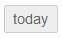
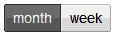
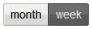

When opened, the Events View displays a Calendar of Events: 

The sample above shows a monthly view, with the current date highlighted
(July 26, 2012 in this example). By default, the last month or week that
was viewed will display when returning to the Events View page.

The events shown will be color coded according to the
[[Calendar|events-Calendars]] that they are assigned. Past events,
which occurred before today's date will appear on the calendar as
"ghosted" events.

#### Finding a Date

The following view controls are available at the top of the page:

-   **Today**: Click to return the view to the current date:

-   **Left Arrow**: Go back one month/week:

Note that you can click each arrow control multiple times quickly to
advance a number of times rapidly, without having to wait for the events
to display on the calendar.

-   **Right Arrow**: Go forward one month/week:

You can rapidly move back a number of times in the same fashion as noted
above for advancing multiple weeks.

#### Changing Your View

-   **Month**: Click to change the calendar to a monthly view:

-   **Week**: Click to change the calendar to a weekly view:

The weekly view always displays the week from Sunday through Saturday,
here's a sample of a weekly view: 

Again, note that the current date is highlighted (July 26, 2012 in this
example).

#### Actions

While viewing either a monthly or weekly calendar of events, you can
perform the following actions:

-   **Click any Event**: To [[Edit the Event|events-Edit]]. It is
    possible to edit "ghosted" (or previous) events.
-   **Click on a blank space on any Date**: To [[Add a New Event on that
    Date|events-New]].

* * * * *

**Feedback**: Click **[[Feedback|Feedback]]** to ask for help, report a problem, or
make a suggestion to the Church360° Team.

**Calendars**: The **Calendars** link at the top right of the page
allows you to control which Calendars' events will appear on screen. For
example, if only the Birthdays and Worship checkboxes are marked, only
Birthdays and events from the Worship calendar will appear on screen. To
change the events shown, mark the appropriate checkboxes.

**Print**: Click **Print** to preview a report for the currently viewed
calendar.

* * * * *

**Related Topics:** [[Calendars|events-Calendars]], [[New
Event|events-New]], [[Edit an Event|events-Edit]]

* * * * *
