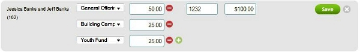

The Enter Offerings screen is used to record gifts given by
the people in your database. It can also be used to update or edit
existing offering records. 

Entering Offerings
-------------------------------------------------------------------------------------------

Each offering is assigned to either a person or an envelope. Note that
envelopes can be shared by multiple people, such as a husband and a wife
(For example, envelope \#100 can be assigned to both John and Nancy
Smith).

Therefore, in order to record an offering for a person, that person must
have a [person record](people-New-Person) in 360Members. If you
want to record an offering for an envelope, that [envelope must be
assigned](people-Profile-View) to at least one person record.

When offerings are entered, they are always assigned a Fund. So, in
order to enter an offering, you must first [Add the
Fund](offerings-Funds) to your 360Members database. Click
**Offerings, [Funds](offerings-Funds)** on the 360Members menu (on
the left side of the screen) to add a new fund or to review your list of
funds.

**To Enter Offerings, perform the following steps:**

#### 1. Select a *Date* at the top left of the screen:

#### 2. Select an *Event* (Optional):

In order for an **Event** to appear in the drop list, it must occur on
the selected **Date** and have the **Offering taken** checkbox selected
[on the Event's settings](events-Edit).

Select an Event only if you want to compare offerings by events.

#### 3. Begin the entry of your actual gifts by entering either a *Name* or an *Envelope* in the *Name/Envelope* field:

As you type your **Name** or **Envelope**, 360Members will show the
matches from your people and envelope data, click a listed item to
select it.

If the offering is a loose offering, defined as any gift which can not
be credited to any individual (such as money placed "loosely" in an
offering plate), leave the **Name/Envelope** field blank.

#### 4. Select the *Fund* for this offering:

The drop list of **Funds** will be divided into two groups:

-   ***Most popular funds***: Shows the top 3 funds for all historical
    offering records. These funds list in order of popularity, with the
    most used fund listed first.
-   ***Other funds***: Shows all other funds, after the top 3.

#### 5. Enter the *Amount* going towards this fund:

#### 6. If the offering was given towards more than one *Fund*, click the green *+* to select another *Fund* and enter its *Amount*:

Repeat this until you are done recording all **Funds** and **Amounts**
for this offering.

#### 7. Enter the *Check \#* (Optional):

Since not all offerings are given by check, this field is optional. If
the offering was given as cash, leave this field blank.

#### 8. Click the *Add Offering* button:

The entry of this offering is now complete. Repeat steps \#3-8 to record
additional offerings for this **Date** and/or **Event**.

Editing Offerings
-----------------------------------------------------------------------------------------

After offerings have been entered for a specific **Date** and/or
**Event**, you can also use the Enter Offerings screen to edit those
records.

#### 1. To begin, make sure to select the proper *Date* and *Event* at the top of the offering screen:

#### 2. To edit a specific offering, click on it:

#### 3. Edit any *Fund*, *Amount*, or *Check \#* for this offering:

If you wish to add another **Fund** to this offering, use the green
**+** sign to add the new line to the offering.

If you wish to delete any individual line item, click the red **-** sign
to do so: 

#### 4. After completing the entry of your changes, click the *Save* button:

Deleting Offerings
-------------------------------------------------------------------------------------------

**To delete a complete offering record (*NOT just one line of the
offering*):**

#### 1. Click the **-** to the right of the total column:

#### 2. Click the red *Delete* button:

#### 3. Click the *OK* button to confirm the deletion:

Totals
-------------------------------------------------------------------

A grand Total for all offerings entered will display at the bottom of
the Enter Offerings page.

To the right of this total will be subtotals showing the total given by
check (the total of all offerings for this date with data in the Check
\# field) and by cash (the total of all offerings with no data in the
Check \# field): 

There is also a link below these totals, labelled **show totals by
fund** (Shown above). Click this to view subtotals for each individual
Fund that offerings were given towards. Once the fund subtotals have
been displayed, there is a corresponding link to **hide totals by
fund**, clicking this reverts to the original totals view, hiding the
fund subtotals for these offerings: 

* * * * *

**Feedback**: Click **<Feedback>** to ask for help, report a problem, or
make a suggestion to the Church360° Team.

**Export**: Click **Export** to export offering data to a CSV
(Comma-Separated Values) formatted data file. CSV is a widely-supported
data format which can be used with other programs (including Windows
Notepad, Microsoft Access, Excel, and Word).

**Print**: Click **Print** to preview or print a report showing the
offering data that is currently displayed.

* * * * *

**Related Topics:** [People List](people-View), [Edit a
Person](people-Profile-View), [Funds](offerings-Funds)

* * * * *
