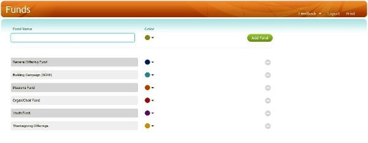
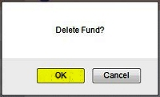

By definition, a Fund is a reason or purpose for which people give
offerings. When offerings and gifts are received by a church, those
gifts could be designated for the church's general fund, for a building
campaign, for a church mission trip, for the youth group, etc. In
360Members, each of those unique designations would be entered as an
Offering Fund: 

#### Creating a New Fund

To add a new fund, enter a **Fund Name**, select a **Color**, and click
the **Add Fund** button: 

#### Editing a Fund

To change a fund's name, click on the **Fund Name**, type in your
changes, then click the **Save** button in the column to the right:

Note that when the fund name is changed, the updated name will appear on
all offerings for that fund, even those gifts which were entered before
the name was changed.

To change the color assigned to a fund, click on the **Color**, choose
the new **Color** from the drop-down selection: 

#### Deleting a Fund

To delete a Fund, perform the following steps:

##### 1. Click the red - for the Fund you wish to delete:

##### 2. Click the red Delete button:

##### 3. Click OK in the Delete Fund? window:

**An important note about deleting any fund:** Since each offering given
is credited towards a fund, 360Members will not allow the deletion of
any fund that has offering records credited towards it.

* * * * *

**Feedback**: Click **<Feedback>** to ask for help, report a problem, or
make a suggestion to the Church360° Team.

**Export**: Click **Export** to export fund data to a CSV
(Comma-Separated Values) formatted data file. CSV is a widely-supported
data format which can be used with other programs (including Windows
Notepad, Microsoft Access, Excel, and Word).

**Print**: Click **Print** to preview or print a report listing your
funds.

* * * * *

**Related Topics:** [Add/Edit Offerings](offerings:%20Enter%20Offerings)

* * * * *

**Go to:** [360Members Help Chapters](Main%20Page) \> [Offering Help
Chapters](Offerings)

* * * * *
