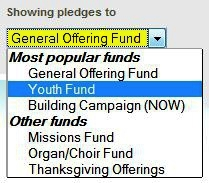
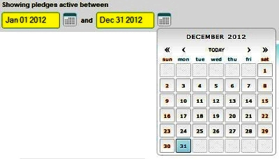
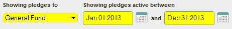
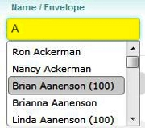
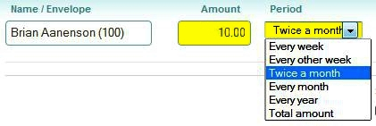
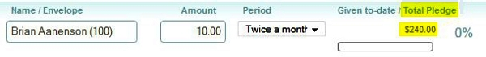
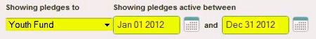
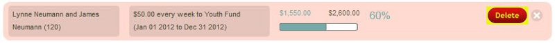
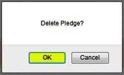
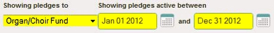

The pledges screen allows you to view, add, edit, or delete
pledge records for your givers: 

Selecting Pledge Criteria
----------------------------------------------------------------------------------------------------------------

To determine which pledges records are displayed, set the proper
criteria at the top of the screen:

### 1. Select a [[Fund|offerings-Funds]] under the *Showing pledges to* drop down:

### 2. Use the Calendar control to set the *date range* under *Showing pledges active between*:

Adding a Pledge
--------------------------------------------------------------------------------------------

To enter a new pledge, perform the following steps:

### 1. Set the proper pledge criteria:

For example, as shown above, if you wish to add a pledge towards your
General Fund for 2013, select **General Fund**, **Jan 01 2013** as the
starting date, and **Dec 31 2013** as the ending date. Note that after
entering these settings, any existing pledges for the same fund and date
range will be displayed.

### 2. Look up or enter a *Name/Envelope*:

### 3. Enter the *Amount* and *Period* for the pledge:

### 4. Verify the *Total Pledge* amount:

### 5. Click the *Add Pledge* button:

Pledge Information
--------------------------------------------------------------------------------------------------

The details section of the page will show pledges matching the criteria
set at the top of the page: 

For each pledge, it will show the name(s) and envelope number for the
pledge; the amount and period for the pledge, with the date range for
the pledge listed in brackets below that; the amount Given to-date
towards that pledge; and the Total Pledge amount. Finally, the graph and
percentage under the Given-to-date/Total Pledge area reflects the
percentage and amount of the pledge that is completed.

At the bottom of each Pledge screen, the **Total pledges** will show the
Given to-date, Total Pledge and Percentage totals for all pledges
meeting the pledge criteria: 

Deleting a Pledge
------------------------------------------------------------------------------------------------

To remove a pledge:

### 1. Set the proper pledge criteria at the top of the page:

For example, if you were looking to delete an existing pledge for a
giver for the Youth Fund that was active in 2012, you would set the
criteria as shown in the image above.

### 2. Locate the pledge you wish to remove, click the red - button:

### 3. Click the red *Delete* button:

### 4. Click *OK* to confirm deletion:

Editing a Pledge
----------------------------------------------------------------------------------------------

To edit a pledge:

### 1. Set the proper pledge criteria at the top of the page:

For example, if you were looking to Edit a pledge for a giver for the
Organ/Choir Fund that was active in 2012, you would set the criteria as
shown in the image above.

### 2. Click on the pledge you wish to change:

### 3. To change the *Amount* or *Period* for the pledge, click it and make changes:

### 3. To change the *Fund* or *Date Range* for a pledge, click it and make changes:

When changing the *Fund*, *Start* or *End Dates*, the pledge could
"disappear" from this listing when the *Save* button is clicked, since
the edited pledge no longer matches the criteria set at the top of the
page. In that case, to view the modified pledge, make the appropriate
changes to the the Pledge Criteria selections at the top of the page.

### 4. Click the *Save* button:

* * * * *

**Feedback**: Click **[[Feedback|Feedback]]** to ask for help, report a problem, or
make a suggestion to the Church360° Team.

**Export**: Click **Export** to export pledge data to a CSV
(Comma-Separated Values) formatted data file. CSV is a widely-supported
data format which can be used with other programs (including Windows
Notepad, Microsoft Access, Excel, and Word).

**Print**: Select **Print** to preview or print a report showing the
pledge data that is currently displayed.

* * * * *

**Related Topics:** [[Add/Edit Offerings|offerings-Enter-Offerings]]

* * * * *
