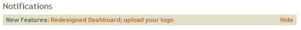

After logging in, the Overview screen will load: 

#### Upcoming Events

On the left side of the Overview will be a "timeline" list of the
upcoming events in your calendar for the next 8 days: 

Each day will list the first three events on that date. Click on an
event's name to go to the [[Edit an Event|events-Edit]] page for that
event.

If there are more than 3 events scheduled on a date, there will be a
**more** link indicating the number of additional events on that date.
For example, if there are 3 more events on a date (in addition to the 3
events showing for that date), the link will read **3 more**. Clicking
that link will take you to the [[monthly calendar of
events|events-Monthly-View]] for that date to show all of the
events scheduled.

Underneath the listing for the Upcoming Events will be a listing of the
number of anniversaries and birthdays during this same 8-day period for
the following birthdays and anniversaries: 

Each item will show the number of those events which occur during the
upcoming 8 days. For example, if there are 2 Birthdays upcoming, it will
show **2 Birthdays**. Clicking that link will load the [[monthly
calendar|events-Monthly-View]] showing those upcoming events. Note
that if there are no events of a type upcoming, the listing will
indicate that there are no events and that item will NOT have a link to
the monthly calendar page (since there are no events of that type for
the upcoming dates).

Note: the birthday and anniversary events will never appear as
individual events listed under a date in the timeline. They only show in
the listing of birthdays and anniversaries at the bottom of the Upcoming
Events timeline on the Overview.

#### Notifications

The Notifications area at the top right of the Overview page will list
features added to 360Members during recent updates to the program. Each
notification item is a link which will take you to a page with further
information on the new feature. Clicking the **Hide** link to the right
of a notification acknowledges or clears the notification. After
clicking to hide a notification, it will be removed. Note that if there
are no current Notifications, this section of the page will not display.

Note: Notifications work on a per person basis. Each user has control
over their own Notification area. When they hide a notification, it only
affects this area for their username. Therefore, one user may have no
current notifications (since they have hidden all of them); while
another user will still be displaying the recent notifications on their
Overview screen (since they have NOT hidden them yet).

#### Data Health

The Data Health section provides reminders about data that needs to be
entered into the [[Attendance|Attendance]] and [[Offerings|Offerings]] areas of 360Members.

When you [[add Events|events-New]] into 360Members, you can select
check boxes to indicate if Attendance is taken, if Communion is served,
or if an Offering is taken. At some point following the date of those
events, 360Members expects that this data will be [[Entered into
Attendance|attendance-Enter-Attendance]] or [[Recorded as an
Offering|offerings-Enter-Offerings]]. The Data Health area
indicates the number of past events which have not had attendance
recorded (either the people who attended or communed at an event) or
have not had offerings recorded.

Initially, the data health is indicated by listing the number of events
without this data, displaying, for example: 

In this example, the data health is indicating that there are currently
6 past events, where the event record indicates that either Attendance
was taken or that Communion was served, but no Attendance data has been
entered. It is also indicating that there are 6 past events, where the
event record indicates that an Offering was taken but no offerings have
been entered.

Each of those displays can be clicked to expand that section, listing
the events which are missing data, five at a time. For example, an
expanded list for the Attendance section might read as follows: 

The **Enter Attendance** link can be clicked for an individual event to
go to the [[Enter Attendance|attendance-Enter-Attendance]] page for
that event. Clicking an event's name will take you to the [[Edit
Event|events-Edit]] screen for that event.

The expanded offering section works in the same manner, except that the
link to **Enter Offerings** will take you to the [[Enter
Offerings|offerings-Enter-Offerings]] page for that event.

#### Recent Attendance

The Recent Attendance graph displays membership, attendance and giving
data. 

The values on this graph show the following data:

-   Membership: Shows the number of current members in the congregation.
    People with a member status of Visitor or Former Member do not count
    towards this total.
-   Worship Attendance: Displays the total number of people who attended
    an event on the Worship calendar that week.
-   Education Attendance: Displays the total number of people who
    attended an event on the Education calendar that week.
-   Giving: Shows the total amount (in dollars) of offerings entered
    that week.

The arrow controls at the left and right edge of the graph, labelled as
**People** on the left edge and **Amount** on the right, allow you to
manipulate the dates for the graph's five-week display. By clicking them
you can view data for different time periods: 

By default, when first viewing the graph, you will be looking at data
for the six most recent weeks as a line graph. You can change the range
and or time period of the graphed data by using the **+** and **-**
slider control at the top left of the graph: 

By sliding it up and down, you can change the time period the graph from
weekly to a three-month, six-month, twelve-month, three-year, or
five-year long time period. Here's an example of a yearly view (note how
the slider bar position was changed to achieve this): 

To the right of the slider bar is a control to toggle between a bar
graph and a line graph view: 

Here's an example of a bar graph display: 

When you hover or point your mouse directly over any item on the graph,
the individual value will display: 

* * * * *

**Feedback**: Click **[[Feedback|Feedback]]** to ask for help, report a problem, or
make a suggestion to the Church360° Team.

* * * * *

**Related Topics:** [[Feedback|Feedback]], [[New Person|people-New-Person]],
[[Events|Events]], [[New Event|events-New]], [[Monthly
View|events-Monthly-View]], [[Edit an Event|events-Edit]],
[[People|People]], [[Attendance|Attendance]], [[Offerings|Offerings]]

* * * * *
