This page provides controls for editing Household information. It is
also used to identify the members of each Household, as well as to
delete a household from the database. 

### Changing the Household Name

To change the name of a Household:

#### 1. Click the *Edit* link next to the Household's Name:

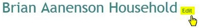

#### 2. Make changes to the name, then click the *Update* link:

### Send Newsletter

**Mark** this box to designate this Household as receiving your church
newsletter, or **Unmark** it if the Household will not be receiving the
newsletter: 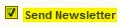

### Change Portrait

To attach or change the image file associated with a household:

#### 1. Click the **Change Portrait** link under the photo area:

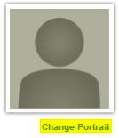

#### 2. Click on the **Browse...** button:

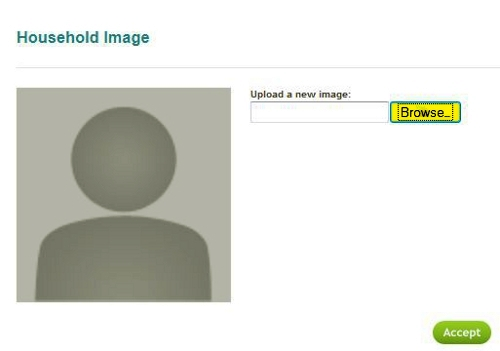

#### 3. Select your file in the browse window:

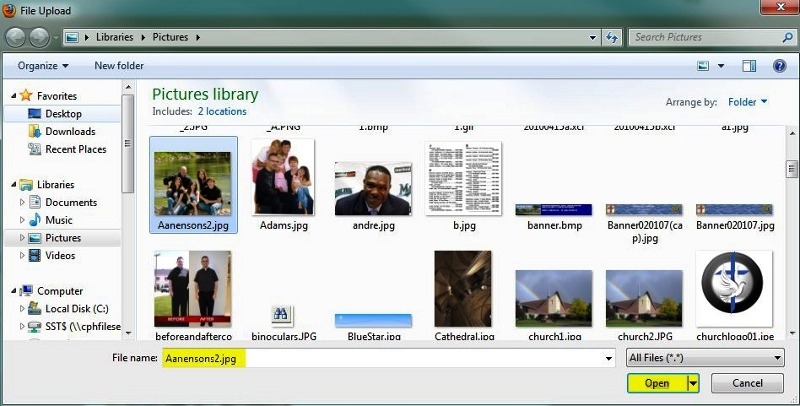

**Note: Browse window may look different depending on your browser and
operating system.**

Portraits in Church360° can be loaded from files saved in the following
image file formats: JPEG, PNG, BMP, TIFF, and GIF.

#### 4. Click the *Accept* button to save the image:

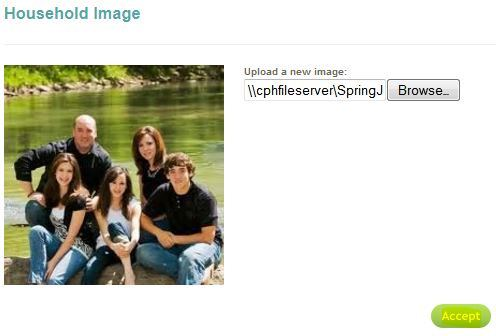

#### 5. Image is now attached to the Household Record:

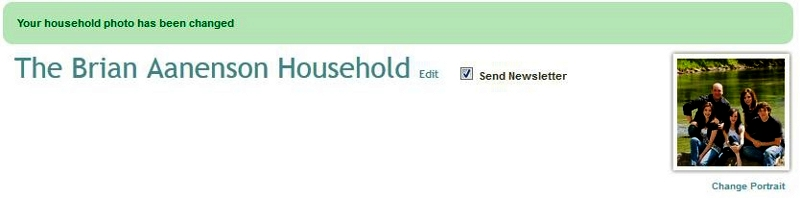

General Tab
--------------------------------------------------------------------------------------

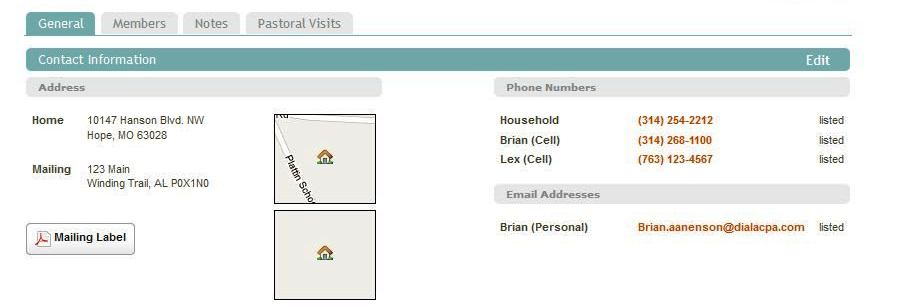

### Contact Information

Click ***Edit*** to change or update address, phone, or email
information for the household: 

-   ***Home Address***: Lists the main address for the household:

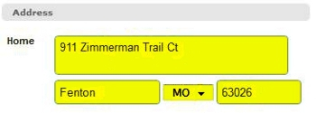

-   ***My mailing address is different***: When ***marked***, enables
    the entering of any alternate mailing address for this household.
    -   ***Mailing Address***: ***Enter*** any alternate mailing address
        for the household here. This alternate could also be used for
        "snowbirders" or any household that spends a time period at
        another address:

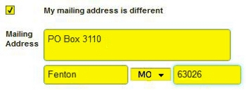

-   ***Phone***: ***Enter*** the digits of the phone number, and check
    if it is a ***Listed*** number (leave unchecked if the number is
    ***unlisted***). Use the ***green +*** and ***red -*** buttons to
    add another number or delete a phone number:

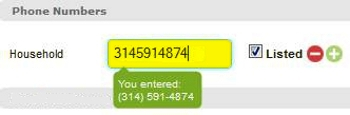

-   ***Email***: ***Enter*** the email address, and check if it is a
    ***Listed*** email address (leave unchecked if the address is
    ***unlisted***). Use the ***green +*** and ***red -*** buttons to
    add another address or delete an email address:

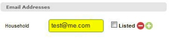

Note that in the ***Phone*** and ***Email*** sections, information will
populate from the individual person records for the members of this
household. That member's name will appear to the left of the phone
number or email address.

When you have completed making your changes to Contact Information,
click the ***Update*** link to save your changes: 

#### Maps

Each address will have a small map image next to it: 

Clicking the map image will bring up a large view of the map and its
surrounding area. The following image shows the same map side-by-side,
in both Map View and Satellite View. Normally, you can only see one or
the other, depend on whether **Map *or*** *Satellite **is selected at
the top right:*** 

Each address nearby will be represented by a house icon. Map data is
provided from Google Maps. The **+** and **-** buttons at the top left
will zoom in or zoom out the map. The **Reset** link will reset the map
back to its initial display, and the **Print** link will print the
current map.

Clicking the **Go to Google Maps** link will open a new browser window,
showing the address at the Google Maps website: 

When done viewing the Map, click the **Close** button to close the map
window.

#### Mailing Label

Click the **[[Mailing Label|Download-Mailing-Labels]]** button to
print a mailing label for the Household: 

Members Tab
--------------------------------------------------------------------------------------

### Members of the Household

 

Members of the Household are defined as the people who are the current
residents of the household. These people currently reside at this
household's location (and may or may not be related by family).

#### Adding a Member to a Household

##### 1. Begin *entering* the name of the person you wish to add in the **Add Member** box:

##### 2. Click on the proper ***name*** to select that person:

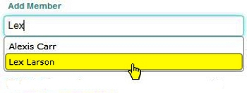

A reminder: in order to [[add a person|people-New-Person]] to a
Household, the person record must be entered first.

##### 3. After you have made your selection, click the ***Add New*** button to finish adding this person to this household:

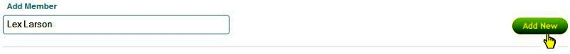

#### Moving a Person to a New Household

An individual person can only be a **Member** of one household record at
a time. To move a **Person** to a new household, go to the person's
profile view, click

\> that person's **Household** record, and follow the steps above for
**Adding a Member to a Household**. *It is **not** necessary to delete
that person from their old household.*

#### Deleting a Member of the Household

To delete a Member of the Household, perform the following steps:

##### 1. Click the red *-* button for that person's row:

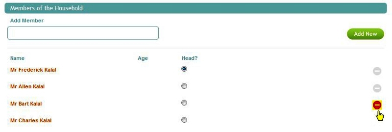

##### 2. Click the red *Delete* button to confirm deletion:

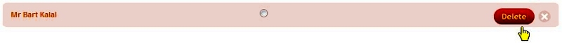

#### Head of Household

One **Person** in each Household is designated as the **Head of
Household**. To make a person the head of their household, mark the box
to do so: 

Notes Tab
----------------------------------------------------------------------------------

Household notes can be added, viewed or edited from this tab.

### To add a Note:

#### 1. Enter your text into the box provided:

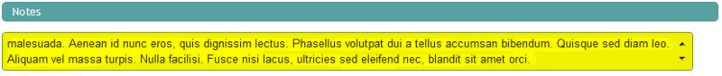

#### 2. Set who can view the Note:

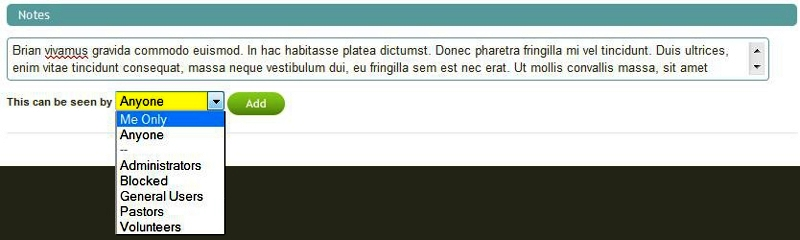

You can set this to the following options:

-   Me Only: This note will be private, only the current user can see
    it.
-   Anyone: All users can view the note.
-   Only members of the selected **Permissions Group**: The groups
    listed separately, below the Anyone option, are the Permission
    Groups for your Church360° database. Only those users who are
    members of the selected group would be able to view the note (In our
    example above, Administrators, Blocked, General Users, Pastors, and
    Volunteers are the current Permission Groups for this church).

#### 3. Click the *Add* button:

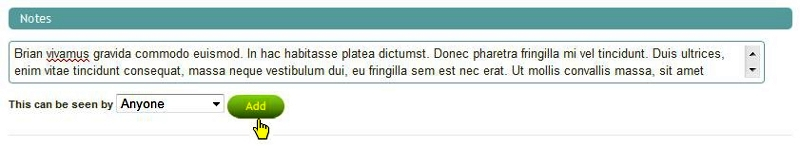

### To edit a Note

Click on the text of the note to edit it. After making any changes,
click the **Save** button: 

### To delete a Note

#### 1. Click on the red circle icon for the note you wish to delete:

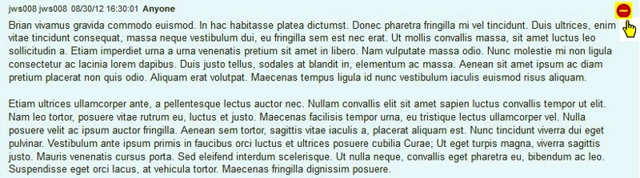

#### 2. Click the red Delete button:

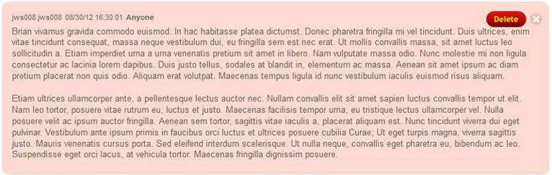

#### 3. Click *OK* to confirm:

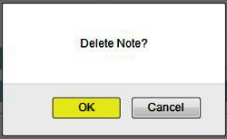

Pastoral Visits Tab
------------------------------------------------------------------------------------------------------

Pastoral Visits is the final tab on the Household View. This tab shows
the date, visitor, visit type and whether or not communion was taken by
the selected individual.

Note: [[Pastoral Visit|people-Pastoral-Visits]] must be added prior
to visits showing on the profile view.

* * * * *

**Feedback**: Click **<Feedback>** to ask for help, report a problem, or
make a suggestion to the Church360° Team.

**Delete**: Click **Delete** to remove this household and all its
members from Church360°.

* * * * *

**Related Topics:** [[New Person|people-New-Person]], [[Download
Mailing Labels|Download-Mailing-Labels]], [[Download Contribution
Statements|Download-Contribution-Statements]]

* * * * *
