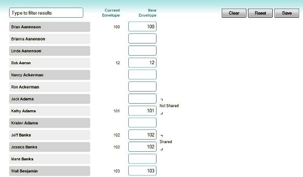

The Envelope page is used to renumber your currently assigned envelope
numbers. It can also be used to assign numbers to people records who do
not have envelope numbers assigned to them. Note that envelope numbers
can also be assigned to a person by [[editing their person
record|people-Profile-View]]. 

#### Filters

The filter controls at the top of the screen allow you to select which
people are listed below. You can choose to view envelope assignments for
**All People** in your database, or for any **[[Smart
Group|people-Smart-Groups]]**. Use the **as of** date selection to
set the date that these envelope numbers are active: 

This date will typically be at the beginning of a calendar year when
performing a mass renumbering process, but it is permissible to use any
date (past, current, or future).

#### Automatic Renumbering

Beneath the filters is a control which will automatically renumber all
envelopes alphabetically, starting with the entered number: 

After selecting that starting number, click the **Renumber** button to
assign **New Envelope** numbers to each person listed. Note that you
will still have to click the **Save** button to permanently set these
changes.

#### Envelopes

The remainder of the page will list out all of the people matching the
filter criteria, showing their **Name**, their **Current Envelope**
number (if they have one assigned), and their **New Envelope**:

##### Envelope Sharing

Couples from the same household will also have an indicator to the right
of this column, showing if they are currently sharing an envelope or
not. In order to potentially share an envelope number, couples must
[[Members of the same Household|people-Edit-a-Household]], and
must be linked as spouses in the [[Family section of their person
records|people-Profile-View]]. The following image shows an example
of two couples - the first couple, Jack and Kathy Adams, are not sharing
an envelope number, as Jack has no number, while Kathy is assigned
envelope \#101; the second couple, Jeff and Jessica Banks, are sharing
envelope \#102: 

##### Making Changes Manually

It is possible to manually enter, modify, and assign each person's
envelope number, entering your changes in the **New Envelope** field.

If there is an issue with the manually entered information, this will
also be noted to the right of the **New Envelope** column. For example,
if envelope \#12 is entered for Nancy Ackerman, and that number was
already assigned to Bob Aaron, a message will appear to the right of
Nancy's New Envelope field, indicating this: 

##### Clear, Reset, and Save

-   Clicking the **Clear** button makes all **New Envelope** fields go
    blank, removing all assignments to this field for every record
    listed.
-   Clicking the **Reset** button reverts all the **New Envelope**
    fields back to their last saved value.
-   Clicking the **Save** button saves all changes made in the **New
    Envelope** field.

*No matter what process, automatic or manual, you have used to set your
**New Envelope** numbers, you must click* **Save** *to permanently save
your changes.*

Navigating away from this Envelope page without clicking **Save** will
result in no changes to your envelope numbers.

One final note: Once envelope numbers have been assigned and changed,
they will automatically go into effect on the *as of* date set in the
filter controls at the top of the page. There is no need to run a
utility to activate these new envelope numbers, they will be active for
an offerings entered on or after that date (or until whatever future
date envelope numbers are changed again).

* * * * *

**Feedback**: Click **[[Feedback|Feedback]]** to ask for help, report a problem, or
make a suggestion to the Church360° Team.

* * * * *

**Related Topics:** [[People List|people-View]], [[Edit a
Person|people-Profile-View]], [[Funds|offerings-Funds]], [[Edit
Household|people-Edit-a-Household]]

* * * * *
