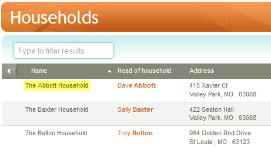
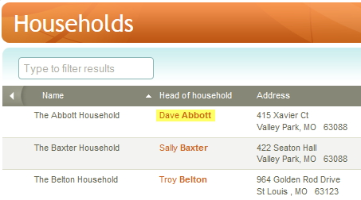
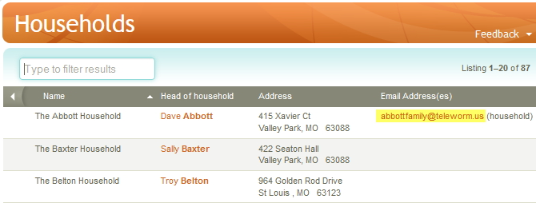
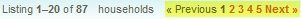
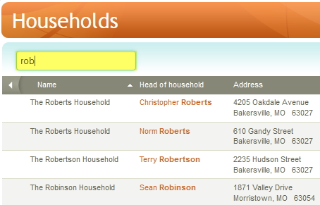
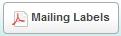
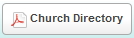

## People: Households

Household records are created in Church 360° automatically when:

-   A new person is added to the system and an address is entered.
-   An address is added to a person record who previously had no address
    (from a person's profile page).

*Note: Since household records are created automatically by the above
methods, there is not a link or page in Church 360° to add a new
household.*

The main Households page displays a list of your current
Households with selected contact information: 

### Page Options and Controls

-   To [[Edit a Household|people-Edit-a-Household]] click on the
    ***Name***:

-   To [[Edit the Head of Household's|people-Profile-View]] personal
    information, click on their name in the ***Head of Household***
    column to open their Person record:

-   To ***Send an email*** to a listed address, click on the listed
    ***Email Address*** which will open your default email program and
    create a new email with that address selected in the To: field.

-   The page controls at the top right and bottom right of the screen
    allow you to move between the pages of your households. **\<\<
    Previous** moves back one screen; **Next \>\>** moves forward one
    screen; clicking on a **Page Number** goes to that page:

Note: Households list in groups of 20 per page.

-   You can type in the **Type to filter results** box to search for a
    household by name or part of a name:

For example, entering *be* in the filter box will change the household
list to only show those households with the letters *be* contained in
their household name.

##### Households Action Buttons

Households has two action buttons at the bottom of the view.

-   Click the **[[Mailing Labels|Download-Mailing-Labels]]** button
    at the lower left of the screen to print mailing labels for the
    listed Households:

-   Click the **[[Church
    Directory|Download-Congregational-Directory]]** button at the
    lower left of the screen to print a church directory report for the
    listed Households.

* * * * *

Click **[[Feedback|Feedback]]** to ask for help, report a problem, or make a
suggestion to the Church360° Team.

Click **Columns** to select which fields to display on the household
list.

Click **Export** to export the household data to a CSV (Comma-Separated
Values) formatted data file. CSV is a widely-supported data format which
can be used with other programs (including Windows Notepad, Microsoft
Access, Excel, and Word).

Click **Print** to preview or print a report listing all households.

* * * * *

**Related Topics:** [[Edit a Household|people-Edit-a-Household]],
[[Download Church Directory|Download-Congregational-Directory]],
[[Download Contribution
Statements|Download-Contribution-Statements]], [[Download Mailing
Labels|Download-Mailing-Labels]]

* * * * *
