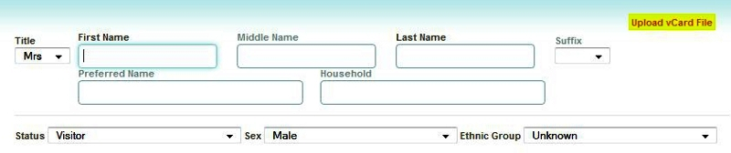
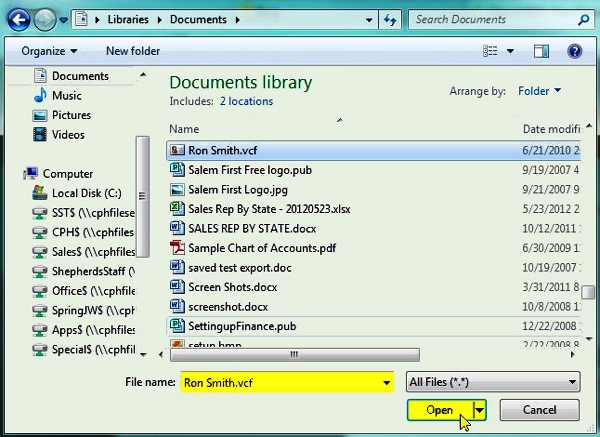
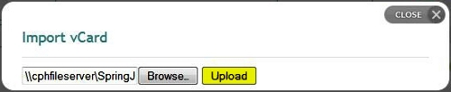

 The New Person page allows you to add new people records
into your database: 

Introduction
-------------------------------------------------------------------------

The basic process for adding a new person record is to fill in the
fields with known information, then click the **Add Person** button at
the lower right of the screen. The following information on this page
deals with the details for doing so. Make sure you understand which
fields are required, and how person and household records are created
before proceeding.

List of Person Fields
-------------------------------------------------------------------------------------------

-   **Title**: Mr, Mrs, Ms, Dr, Rev, or Rev Dr
-   **First Name**: Formal first name (i.e.: Robert)
-   **Middle Name**: An initial is also acceptable
-   **Last Name**: Note that this does not need to match the household
    name (i.e.: "Jane Smith" can be a member of "The John Doe
    Household")
-   **Suffix**: Select from Jr, Sr, II, III
-   **Preferred Name**: Informal first name or nickname (i.e.: Bob)
-   **Household**: The **Household** that this person is a member. To
    determine how to complete the Household field, see the instructions
    below in the [Person and Household
    Records](people:%20New%20Person#Person%20and%20Household%20Records)
    section below.
-   **Status**: Member status; your options here will vary, depending on
    the denomination of your Church.
-   **Sex**: Male or Female
-   **Ethnic Group**: Select a category

The following fields are required when adding a person: **Title, First
Name, Last Name, Status, Sex,** and **Ethnic Group**. Note: These fields
are highlighted in the screen image at the top of this help page.

Person and Household Records
---------------------------------------------------------------------------------------------------------

When adding a new person, users should be aware of how their Household
record will be determined; there are two options:

### 1. Adding a Person to an Existing Household:

Perform a lookup and selection of an existing household record, by
entering that household name in the **Household** field and clicking on
the appropriate household: 

After selecting the Household from the lookup list, its Contact
Information will load in the lower portion of the screen. Fill out the
remaining personal information, then click the **Add Person** button to
add the new person both to your database and as a Member of that
existing Household Record: 

### 2. Adding a Person and Creating a New Household (at the same time):

When entering the new Person's information, leave the **Household**
field in the top portion of the page blank: 

Fill in the Contact Information, then click the **Add Person** button:

The new Person record will be added to your database and a new Household
Record will also be created. The person will also automatically be added
as a Member of this Household Record.

\<\\!-- ===3. Adding a Person Record only (without making the person a
Member of a Household)=== When entering the new Person's information,
leave the **Household** field in the top portion of the page blank:

Leave all fields in the **Contact Information** section blank, then
click the Add Person button: 

Therefore, it is possible to have a person record in *Church360°* who
is not assigned to a specific household. This is often an easy method
for entering Visitors into your database on their first visit, where you
may not have all of their contact and family information ready to enter.
Note: It is possible to later add such a person record to a household
record by [editing a Household record](people:%20Edit%20a%20Household),
and adding the person under the Members of the Household section. --\>

Upload vCard File
-----------------------------------------------------------------------------------

To upload person data from a vCard file, perform the following steps:

### 1. Click the *Upload vCard File* link at the top right of the New Person page:

### 2. Click on the **Browse...** button to locate the vCard file:

### 3. Locate your file, select it and click the *Open* button:

### 4. Click the *Upload* button:

### 5. You will receive a message confirming the people were imported at the top of the page:

Your data is now imported into 360Members.

* * * * *

Click **<Feedback>** to ask for help, report a problem, or make a
suggestion to the Church360° Team.

* * * * *

**Related Topics:** [Households](people:%20Households), [Edit a
Household](people:%20Edit%20a%20Household)

* * * * *
