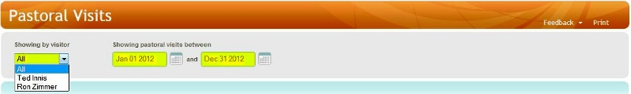
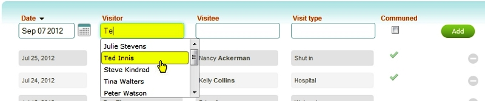
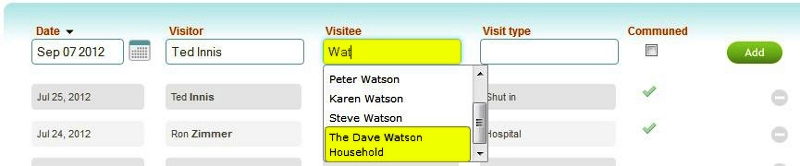
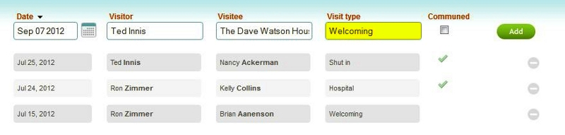
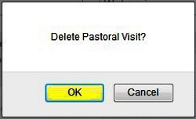

Visits are an important part of ministering to a congregation. Whether
making a visit to the hospital to encourage or provide communion to an
ailing member, stopping in to provide council to a family, or making a
welcoming visit to new members or visitors of the church, Pastoral
Visits provides a place to enter a record of these visits: 

### Filter Controls

At the top of the page are filter controls that determine which visit
records will list on the page:

-   Showing by visitor: Select All to see visits from all Visitors or
    select a particular person to filter the list for that Visitor.
-   Showing pastoral visits between: Select the date range, using the
    date controls, to show visit records during this time period.

### Adding a Pastoral Visit

#### 1. Select the *Date* the Visit occurred (defaults to the current date):

#### 2. Perform a lookup in the *Visitor* field, selecting the name of the pastor who made this visit:

#### 3. Perform a lookup in the *Visitee* field, selecting the person or household being visited by the pastor:

Note that either one individual (a person) or one household (a family)
can be selected as the Visitee for a Pastoral Visit record.

#### 4. Enter a *Visit Type*:

(Note: You can perform a lookup of previously used types)

#### 5. Indicate if a Private or Personal Communion was part of the Visit (Mark Communed):

#### 6. Click the green *Add* button:

### Editing a Pastoral Visit Record

#### 1. Click on the row of the record you wish to edit:

#### 2. Make changes to the *Date*, *Visit Type*, and/or *Communed* fields:

#### 3. Click the *Save* button:

### Deleting a Pastoral Visit Record

#### 1. Click on the red circle to the right of the visit record:

#### 2. Click the red Delete button:

#### 3. Click *OK* to confirm deletion:

* * * * *

Click **[[Feedback|Feedback]]** to ask for help, report a problem, or make a
suggestion to the Church360° Team.

Click **Print** to preview or print a report listing the Pastoral Visits
that are currently displayed.

* * * * *
