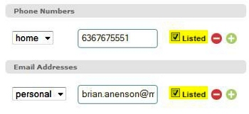
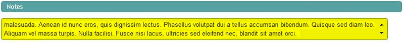
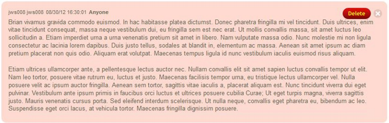
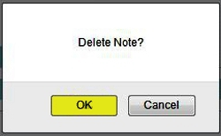

\<\\!----\> This view provides controls for adding, changing, or
deleting information for a person's record. It is also used to identify
family relationships and to delete the person from your church database.

Member Information
-------------------------------------------------------------------------------------------

### Person Name

To change the person's name-related information (**Title**, **First
Name**, **Middle Name**, **Last Name**, **Preferred Name**, **Maiden
Name** or **Suffix**), click the **Edit** link next to their name:

Make the appropriate changes, then click the **Update** link to save
your changes: 

### Member Status

Underneath the person's name is their current member status (this was
initially set when the [person was added](people:%20New%20Person) to
your Church360° database): 

#### Viewing Status History

Clicking the **(History)** link (highlighted in image above) will show
the person's member status history, showing the changes in status and
the dates those changes were entered. Clicking **Back to Profile**
returns to the People: Profile screen: 

#### To record a change in Member Status:

##### 1. Back on the main profile view page, to make a change in member status, click the **Edit** link:

##### 2. Select the **Action Date** (Year-Month-Day) that the change in status occurred on:

##### 3. Click the proper **Action** reflecting the change in this person's member status:

The image in step 2 (above) shows an example of changing a person's
member status to **Inactive**.

#### To delete a previously entered Member Status

##### 1. Click the *(History)* link to view the person's Member Status history:

")

##### 2. Locate the line with the member status you wish to remove, then click the **red circle icon** at the right end of that row:

")

This will select in red that member status and all changes to member
status entered after it. Since each change in member status is built
upon the member status entered before it, when a member status is
deleted, it not only deletes that status, but will also delete all
changes in member status entered after the item selected to remove.

##### 3. Click the *Delete* button to remove them:

##### 4. Click *OK* in the confirmation box to delete the selected status history items from this person's record:

### Household

The household field displays and provides a link to the Household Record
this Person is a member of: 

Note: The Household field for a particular person can be blank, as it is
possible to add a person record, but not assign them to a household
record.

#### To move a Person to a different Household record

##### 1. Click the *Edit* link located to the right of the Household field:

##### 2. Click the drop-down arrow, and select a *Household* to move this person to:

##### 3. Click the *Close* link to save:

*Note:Household records are created in 360Members automatically when: a
new person is added to the system and an address is entered or when an
address is added to a person record who previously had no address (from
a person's profile page). Since household records are created
automatically by the above methods, there is not a link or page in
360Members to add a new household.*

### Tags

The person's currently assigned [Tags](people:%20Tags) list below their
Household name.

##### To make changes to a person's current Tags, click the *Edit* link:

##### To add a new *Tag* for this person (after clicking the *Edit* link):

Begin typing the name of the Tag in the lookup box, click the wanted Tag
in the list, then click the *Add Tag* button: 

##### To delete a Tag from this person (after clicking the *Edit* link):

Click the red circle button to the right of that tag: 

##### When done adding or removing Tags:

Click the **Close** link to save your changes: 

### Change Photo

To add, change, or delete the image file associated with a person, click
the **Change Photo** link under the photo area: 

Click on the **Browse...** button to locate a file:

Locate your image file, select it, and click the **Open** button: 

Photos in Church360° can be uploaded from files saved in the following
image file formats: JPEG, PNG, BMP, TIFF, and GIF.

Click the **Accept** button: 

To remove a photo, open the Profile Image window by clicking the
**Change Photo** link, then click the Remove Photo button:

General Tab
-----------------------------------------------------------------------------

### Contact Information

Click **Edit** to change or update address, phone, or email information
for the household: 

-   **Home Address**: Lists the main address for the household:

If you make a change to this address information, and then click the
**Update** link (at the top right of the Contact Information heading),
you will see the following prompt: 

Selecting the first option changes the address for this person's current
Household record. Selecting the second option creates a new Household
record and moves this person into that new Household. Mark the
appropriate option and click the **Save Household *button.***

-   **Check here if this person is away**: When **unmarked**, indicates
    that this person is currently residing at the Home Address. When
    this is **marked**, this changes to read that the person is: and
    provides a box to indicate their status (i.e.: away, at school,
    serving in the military), as well as an **Away** address box for
    entering in their personal alternate address:

That address will be used as this person's current address. Note that
this change only applies to this person, not to the other Members of
this Household.

-   **Phone**: To add a phone number, select the **type** of phone
    number: Home, Work, or Mobile, **enter** the phone number, and click
    the green **+** sign:

You can also click the **red circle** icon to delete a phone number.

-   **Email**: To add an email address, select the **type** of email
    address, **enter** the email address and click the green **+** sign:

You can also click the **red circle** icon to delete an email address.

-   **Listed/Unlisted Checkbox**: There is a checkbox next to each phone
    number and each email address to indicate whether that information
    is listed or unlisted. When the checkbox is marked, the item has a
    listed status; when the checkbox is unmarked, the item has an
    unlisted status:

After entering any changes to any of the Contact Information, click the
**Update** link to save them: 

#### Maps

Each address will have a small map image next to it: 

Clicking the map image will bring up a large view of the map and its
surrounding area. The following image shows the same map side-by-side,
in both Map View and Satellite View. Normally, you can only see one or
the other, depend on whether **Map *or*** *Satellite **is selected at
the top right:*** 

Each address nearby will be represented by a house icon. Map data is
provided from Google Maps. The **+** and **-** buttons at the top left
will zoom in or zoom out the map. The **Reset** link will reset the map
back to its initial display, and the **Print** link will print the
current map.

Clicking the **Go to Google Maps** link will open a new browser window,
showing the address at the Google Maps website: 

When done viewing the Map, click the **Close** button to close the map
window.

#### Mailing Label

Click the **[Mailing Label](Download%20Mailing%20Labels)** button to
print a mailing label for this person: 

### Personal Information

To change this person's demographic or anniversary information, click
the **Edit** link at the top right of this section: 

Make the wanted changes, then click the **Update** link to save your
changes: 

Note that each of the date fields under Anniversaries will allow partial
entry (i.e.: a birthday can be entered as Jan 1, 1980 or Jan 1 or 1980.
It is advised that users enter all known date information). Also, it is
possible to denote that a person is **Baptized**, **Confirmed**, or
**Deceased** by only marking the appropriate checkbox without filling in
a date.

Family Tab
---------------------------------------------------------------------------

Shows the family relationships of the current person. Note that this is
a different group/linkage than the [Members of the
Household](people:%20Edit%20a%20Household#Members%20of%20the%20Household)
on the household page (which shows the people who are residents of that
current household). This family area is meant to show the related family
members for the current person. Family members are classified by their
relationship to this person.

#### To add a Family Member

##### 1. Perform a lookup of that person record by typing their name (or a part of their name) in the *Add Family Member* box, then clicking the name to select it:

##### 2. Choose the wanted *Relationship* for this person:

##### 3. If using a related *Relationship* (such as *Spouse*), enter the *Wedding Date*:

##### 4. Click the *Add New* button:

The family member is now added. Note that this relationship will show in
the **Family** section of the Person records for each of the people
involved.

Attendance Tab
-----------------------------------------------------------------------------------

#### Attendance

Shows the **Upcoming Events** the Person is [Enrolled
in](events:%20Edit#Regular%20Attenders) and <Attendance> information for
the current person.

-   Upcoming Events: Shows the upcoming events the person is currently
    enrolled in and the next occasion when those events will be held.
    Regular Attenders are set for each event when [editing that
    event](events:%20Edit#Regular%20Attendees) or by marking the Regular
    checkbox when [entering
    Attendance](attendance:%20Enter%20Attendance) for that event.
-   Attendance: Shows the last worship service this person attended, the
    last time they communed, and the last time they attended a bible
    class. Also shows the total number of services and the total bible
    classes attended in the current calendar year.

#### Trends

Select a year to display attendance Trends for each event this person
attended during that year: 

Each dot on the chart represents one event attended for that event; the
columns of the chart represent the months of that year. So, the Trends
chart will show the person's pattern of attendance during the selected
year.

##### Attendance Summary

The Attendance Summary table shows the detailed totals from the chart,
showing the numbers of times the person attended each event, the total
number of times each event was held, and the corresponding percentage.

Offerings Tab
---------------------------------------------------------------------------------

Shows giving information for the current person:

#### Pledges

The pledges area will list out this person's active pledges (meaning
that today's date falls between the starting and ending date for each
pledge listed). Each pledge will list, showing the amount
pledged-to-date, the amount given-to-date, and the difference between
those two numbers: 

#### Offerings

The offerings area lists the person's currently assigned envelope
number, the date and amount of their last offering given, and the total
amount of all Offering they have given to date for the current year:

##### To Change a Person's Envelope Number:

-   Click the **(Change)** link next to their Envelope Number:

 link")

-   Enter the **Number** to assign to this person, and select a **Date**
    for the person to start using this Number:

-   Click the **Accept** button to save the new envelope number:

#### Trends

Select a Date Range to view offering data for: 

A graph will display, showing this person's giving by month: 

Below the graph a total amount of offerings, for each fund and for all
funds, will display in the **Giving Summary** section.

The lower section of the Trends shows **Giving Details** showing each
individual offering given during the date range set for Trends: 

Click the **Download Contribution Statement** button to print out an
offering statement for this person: 

Click the **Download CSV** button to save the Giving Details data to a
CSV (Comma-Separated Values) formatted data file. CSV is a
widely-supported data format which can be used with other programs
(including Windows Notepad, Microsoft Access, Excel, and Word):

Notes Tab
-------------------------------------------------------------------------

Person notes can be added, viewed or edited from this tab.

### To add a Note:

#### 1. Enter your text into the box provided:

#### 2. Set who can view the Note:

You can set this to the following options:

-   Me Only: This note will be private, only the current user can see
    it.
-   Anyone: All users can view the note.
-   Only members of the selected **Permissions Group**: The groups
    listed separately, below the Anyone option, are the Permission
    Groups for your Church360° database. Only those users who are
    members of the selected group would be able to view the note (In our
    example above, Administrators, Blocked, General Users, Pastors, and
    Volunteers are the current Permission Groups for this church).

#### 3. Click the *Add* button:

### To edit a Note

Click on the text of the note to edit it. After making any changes,
click the **Save** button: 

### To delete a Note

#### 1. Click on the red circle icon for the note you wish to delete:

#### 2. Click the red Delete button:

#### 3. Click *OK* to confirm:

Pastoral Visits Tab
---------------------------------------------------------------------------------------------

Pastoral Visits is the final tab on the Profile View. This tab shows the
Date, Visitor, Visit Type and whether or not Communion was taken by the
selected individual.

Note: [Pastoral Visit](people:%20Pastoral%20Visits) must be added prior
to visits showing on the [Profile View](people:%20Profile%20View) or
[Household View](people:%20Edit%20a%20Household).

* * * * *

**Feedback**: Click **<Feedback>** to ask for help, report a problem, or
make a suggestion to the Church360° Team.

**Export**: Click to export out this person's contact data as a vCard
file.

**Delete**: Click here to delete this person record from your database.

* * * * *

**Related Topics:** [Households](people:%20Households), [Edit a
Household](people:%20Edit%20a%20Household), [New
Person](people:%20New%20Person), [Tags](people:%20Tags), [Person
Attendance Record](people:%20Attendance%20Records), [Person Offering
Records](people:%20Offering%20Records), [Edit an Event](events:%20Edit),
<Attendance>, [Enter Attendance](attendance:%20Enter%20Attendance),
<Offerings>, [Enter Offerings](offerings:%20Enter%20Offerings),
[Download Mailing Labels](Download%20Mailing%20Labels), [Download
Contribution Statements](Download%20Contribution%20Statements)

* * * * *

**Go to:** [360Members Help Chapters](Main%20Page) \> [People Help
Chapters](People)

* * * * *
