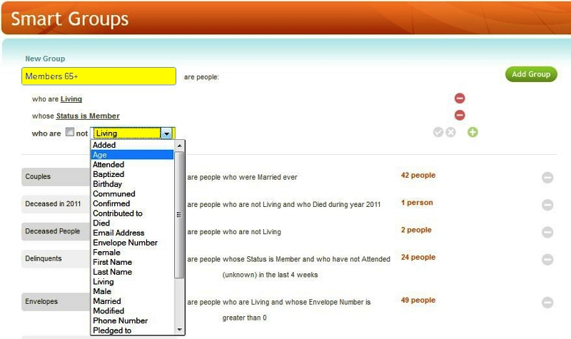
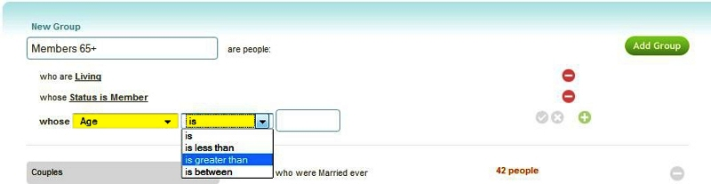
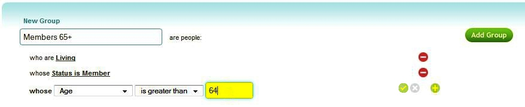
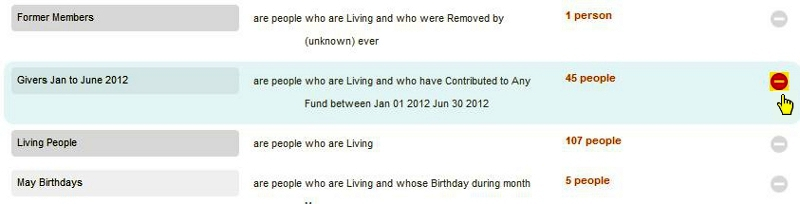
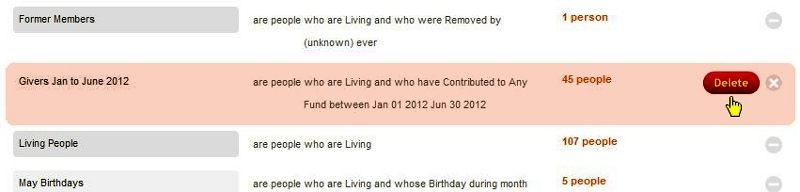
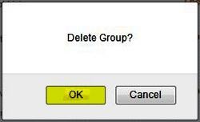

With the Smart Groups feature you select a group of people based on
criteria, identify that group with a Smart Group name, and use it to
select or view information about that group of people: 

The people who are members of a particular Smart Group are defined by a
set of criteria you provide. 

Creating a New Group
-------------------------------------------------------------------------------------------------

To create a new smart group, enter a name for the group in the box to
the left of **are people:** The criteria that defines the group is set
on a line-by-line basis. By default all new groups begin with a preset
first criteria of **who are living**. Other criteria are added by
clicking on the **green +** sign. Choose a criteria to match or not
match (are, or are not) from the drop down list. Depending on the
criteria chosen, you may have other options and drop-downs to define:

For example, if Age is chosen as the criteria, you will also have to
chose if Age is equal to, less than, greater than, or between an entered
Age: 

When finished adding criteria, click the **green checkmark**, or if you
want to add additional criteria for the group, click the **green +**
again: 

If you wish to Remove a criteria from a group, click the **red -** link
at the end of that criteria line.

When you have finished adding all criteria for a group, click the **Add
Group** button to save the new group.

Editing a Smart Group
---------------------------------------------------------------------------------------------------

To edit an existing smart group, click on its name (i.e.: to edit the
criteria for a smart group named *Members*, click on *Members*):

You can now add, edit, or remove criteria in the same manner as when
creating a new group, using the **red -**, **green checkbox**, and
**green +** icons. When done editing, click the **Save** button to save
your changes to the smart group criteria, or click the Grey **X** button
to undo your changes and revert back to the original criteria.

Deleting a Smart Group
-----------------------------------------------------------------------------------------------------

To completely remove a Smart Group:

#### 1. Click the red - circle button to the right of the subgroup's description:

#### 2. Click the red **Delete** button:

#### 3. Click *OK* in the *Delete Group?* box to confirm the deletion of this group:

* * * * *

**Feedback**: Click **<Feedback>** to ask for help, report a problem, or
make a suggestion to the Church360° Team.

**Print**: Select to preview or print a report listing all Smart Groups,
their criteria, and the number of people in each group.

* * * * *

**Related Topics:** [Edit a Household](people-Edit-a-Household),
[Download Congregational
Directory](Download-Congregational-Directory), [Download
Contribution Statements](Download-Contribution-Statements),
[Download Mailing Labels](Download-Mailing-Labels)

* * * * *
