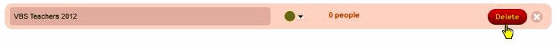
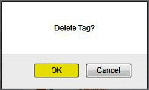

In 360Members, Tags are used to identify groups or categories
that people belong to. They are meant to have a "free-flowing" nature,
and will be different for each church's database: 

### Examples of Tags

Some common examples of groups or categories that a church may set up as
Tags are:

-   ***Activity Groups***: These could be church activities, such as
    Adult Choir, Greeters, Altar Guild, Church Council, Ushers, members
    of a certain small group bible study. They could also be used to
    show members of non-church activity groups, such as children who
    participate in the town's Little League, or Town Council members.
-   ***Skills***: Used to identify both church skills (Worship Banner
    Makers, Bulletin/Newsletter Assemblers, those who can run the
    Powerpoint and projector for the Contemporary service) and outside
    church skills (Accounting, Desktop Publishing, Landscaping).
-   ***Training groups***: Those who are part of a learning group, such
    as members of a New Members' orientation class, a Confirmation
    class, those being trained as Ushers.
-   ***Elder assigned***: Set up groups for each elder (Elder-John
    Smith, Elder-Chris Walker). The people who are assigned to each
    elder can be given the tag for that elder.
-   ***Occupations***: A tag can be created for each occupation that
    people in the database hold (i.e.: Software Engineer, College
    Professor, Homemaker).
-   ***Military Status***: Active Duty, Reverses, Veterans--create tags
    for each status you wish to track.
-   ***School information***: You can set up tags for each school that
    people are currently attending or that people have attended; or for
    each type of degree or certification that people may hold (Masters
    in Law, MSCE certification).

Again, the list above contains some examples of the type of Tags that
may be set up by an individual church. Most churches will have other
tags which they set up for their own groups and categories.

Working with Tags
---------------------------------------------------------------------------------------

### Adding a Tag

To add a new Tag, enter a ***Tag Name***, choose a ***Color***, then
click the ***Add Tag*** button: 

### Editing a Tag

To edit an existing Tag, click on the ***Tag Name*** or the ***Color***,
make changes to either item, and click the ***Save*** button: 

Each tag will also have a link to its right, indicating the number of
people with that tag assigned to them: 

Clicking that link (as shown above)will take you to the [[People
View|people-View]] to display a list of the people with that tag
assigned.

### Deleting a Tag

To delete an existing Tag, perform the following steps:

#### 1. Click on the *red circle* button in the right column of that Tag:

#### 2. Click the red *Delete* button:

#### 3. Click the *OK* button in the *Delete Tag?* confirmation window:

### Assigning Tags to People

Tags are assigned to the people in your church in the following areas:

-   To individual people in your church when [[editing their person
    record|people-Profile-View#Tags]].
-   To multiple people records using the **Add or Remove Tags** button
    at the bottom of the [[People
    View|people-View#Add-or-Remove-Tags]] page.

* * * * *

**Feedback**: Click **[[Feedback|Feedback]]** to ask for help, report a problem, or
make a suggestion to the Church360° Team.

**Export**: Click to export the person view data to a CSV
(Comma-Separated Values) formatted data file. CSV is a widely-supported
data format which can be used with other programs (including Windows
Notepad, Microsoft Access, Excel, and Word).

**Print**: Click to preview or print a report listing all tags and the
number of people assigned to each tag.

* * * * *

**Related Topics:** [[Profile View|people-Profile-View#Tags]],
[[People List|people-View]]

* * * * *
