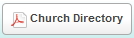

 The people view displays the selected person records,
showing the columns or fields selected in the **Columns** settings (See
the [[Columns and Reports|people-View#Columns-and-Reports]]
section below for details): 

To [[open a person record|people-Profile-View]], click on that
person's name: 

To [[open a household record|people-Edit-a-Household]], click on
the household name (Note: If not seeing a Household column, you may need
to select Household as one of your selected columns under the
**Columns** settings): 

The page controls at the top right and bottom right of the screen allow
you to move between the pages of your households. **\<\< Previous**
moves back one screen; **Next \>\>** moves forward one screen; clicking
on a **Page Number** goes to that page: 

Note: People list in groups of 20 per page.

You can type in the **Type to filter results** box to search for name or
part of a person's name: 

For example, entering *be* in the filter box will change the people list
to only show those people with the letters *be* contained in their name.

You can select or unselect people to perform Actions with by marking the
checkbox to the left of their name: 

The **All** or **None** links at the lower left of the screen will
select or unselect all records in the list: 

#### Selecting a Smart Group

If you wish to view only the people in a certain [[Smart
Group|people-Smart-Groups]]:

##### 1. Click on the *People* link at the top right of the list:

##### 2. Click on the selected *Smart Group* in the drop-down list:

Select a new Smart Group from the drop list and click the gray circle
**x** to right. 

The list view will change to only show the people in that Smart Group.
Note that the People selection at the top of the list of groups is not a
Smart Group; it is used to select all people in your database.

#### Columns and Reports

##### To change the columns that are being displayed in the list view:

Click **Columns** at the top right of the screen, check any fields you
wish to display (and/or uncheck any fields you do not want to display).

When done, click **Columns** a second time to "retract" the check list
of fields.

### Action Buttons

The People view has six action buttons located at the bottom.

##### To save your current settings:

Click the **Save Report** button at the bottom of the page. 

When saving a report, both your current **Column** and your current
**Smart Group** selections are saved together as part of the report.

When working with new settings, you will only have the option to **Save
as a new report**. Enter a **Name** for the report, and click the
**Save** button: 

When working with a previously saved report, users will have the option
to **Save changes to the selected report** (updating and overwriting the
existing report settings) or to **Save as a new report** (preserving
their original report, note that a **Name** for the new report will be
required): 

##### To load a previously saved report:

Click on the **Report Name** link at the top left of the screen (next to
the People header). This may show the word **Custom** if a report has
not previously been loaded, or it will show the name of the report
currently in use ("Donor List" in the bottom of the two images below):

This will display a list of previously saved reports. To load one, click
on its link: 

The saved report will load, showing its name to the right of People at
the top left of the page, and displaying the associated Smart Group and
Column information: 

##### To delete an existing report:

Go to the [[Reports|Reports]] page under the Overview menu, and use the delete
option.

#### Mailing Labels

Click the **[[Mailing Labels|Download-Mailing-Labels]]** button at
the lower left of the screen to print mailing labels for the listed
People: 

#### Church Directory

Click the **[[Church Directory|Download-Congregational-Directory]]**
button to print a church directory report for the listed People.

#### Add or Remove Tags

Click the **Add or Remove Tags** button to select the
[[Tags|people-Tags]] that you want to add to -- or remove from -- the
selected group of people: 

Mark the appropriate checkbox(es), then click the **Add** or the
**Remove** button to add or remove those tags from the selected group of
people: 

This is a common method for assigning or updating Tag settings for a
large group of people simultaneously (as opposed to on a person by
person basis). Note: To add a new tag go to [[Tags|people-Tags]].

#### Send Email

Click the **Send Email** button to send an email to the selected people
via your computer's default email program: 

#### Contribution Statements

Click the **[[Contribution
Statements|Download-Contribution-Statements]]** button to print
offering statements for the selected people: 

* * * * *

Click **[[Feedback|Feedback]]** to ask for help, report a problem, or make a
suggestion to the Church360° Team.

Click **Columns** to select which fields to display on the household
list.

Click **Export** to export the household data to a CSV (Comma-Separated
Values) formatted data file. CSV is a widely-supported data format which
can be used with other programs (including Windows Notepad, Microsoft
Access, Excel, and Word).

Click **Print** to preview or print a report listing the people and data
that is currently displayed.

* * * * *

**Related Topics:** [[Profile View|people-Profile-View]], [[Edit a
Household|people-Edit-a-Household]],
[[Households|people-Households]], [[Download Congregational
Directory|Download-Congregational-Directory]], [[Download
Contribution Statements|Download-Contribution-Statements]],
[[Download Mailing Labels|Download-Mailing-Labels]], [[Smart
Groups|people-Smart-Groups]]

* * * * *
