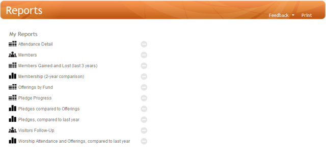

The Reports page is divided into two sections:

-   **My Reports**: A list of custom reports created in the [[View
    People|people-View]] or [[Trends|Trends]] pages.
-   **Special Reports**: Built-in year end denominational reports.

To view a report, click on the report name.

To delete a report, click the grey minus circle symbol, click the red
**Delete** button, and click the **OK** button. Note that Special
Reports cannot be deleted from your system.

**Feedback**: Click **[[Feedback|Feedback]]** to ask for help, report a problem, or
make a suggestion to the Church360° Team.

**Print**: Click **Print** to preview or print a listing of your current
reports.

* * * * *

**Related Topics:** [[Trends|trends]]

* * * * *
